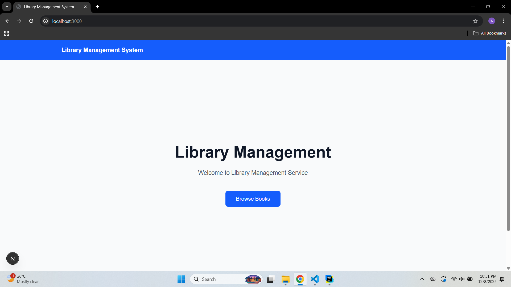
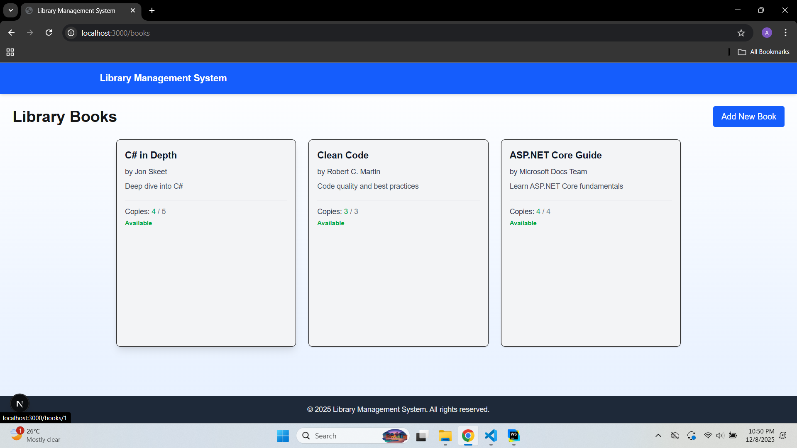
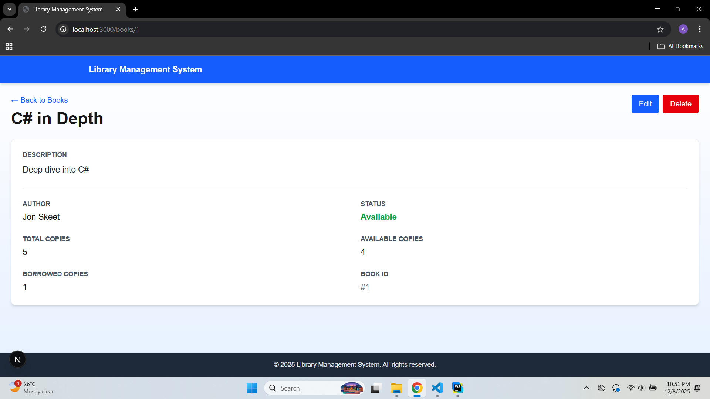
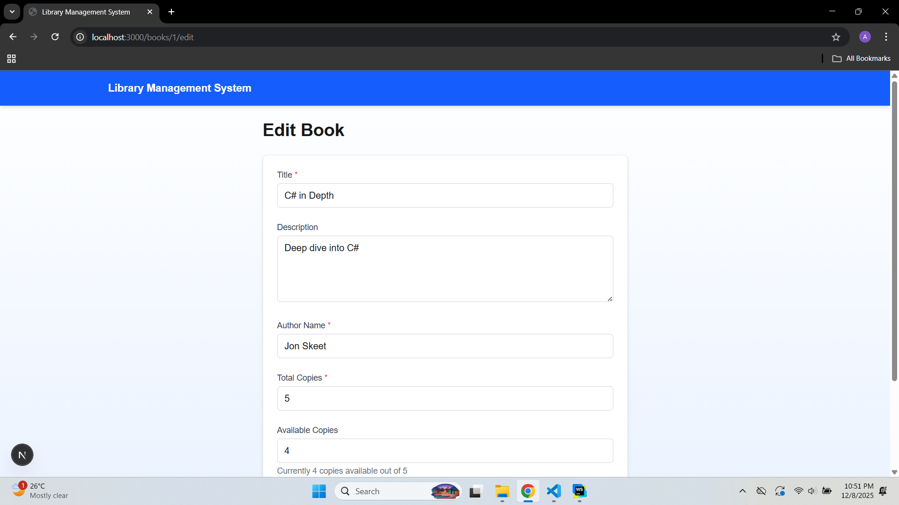

# Library Management Service

A full-stack library management system with a modern web interface and RESTful API backend for managing books, authors, and library operations.

## 📚 Overview

This project consists of two main components:
- **library-service-api**: ASP.NET Core Web API
- **library-service**: Next.js 16 frontend application

## 🖼️ Screenshots

### Home Dashboard

*Clean and intuitive home page with navigation and overview*

### Books Catalog

*Browse and search through the complete catalog of books*

### Book Details

*Detailed view of individual books with comprehensive information*

### Edit Book

*Easy-to-use form for adding and editing book information*


## 📁 Project Structure

```
library-management-service/
├── library-service/          # Next.js 16 frontend application
├── library-service-api/      # ASP.NET Core Web API
├── LMS - API.pdf            # API documentation
├── LMS - Client.pdf         # Client documentation
└── README.md                # This file
```

## 🛠️ Technology Stack

### Backend (library-service-api)
- ASP.NET Core Web API
- RESTful API architecture
- Entity Framework Core

### Frontend (library-service)
- Next.js 16
- React
- Responsive UI components
- Client-side and server-side rendering

## 📖 Documentation

Detailed documentation is available in the following PDF files:
- **LMS - API.pdf**: Complete API documentation with endpoints and usage
- **LMS - Client.pdf**: Frontend client documentation and user guide

## 🚦 Getting Started

### Prerequisites
- .NET 10.0 SDK
- Node.js (v18 or higher)
- npm or yarn package manager
- SQL Server or your preferred database

### Installation

1. **Clone the repository**
   ```bash
   git clone <repository-url>
   cd library-management-service
   ```

2. **Setup Backend API**
   ```bash
   cd library-service-api
   # Configure your database connection in appsettings.json
   dotnet restore
   dotnet run
   ```

3. **Setup Frontend Client**
   ```bash
   cd library-service
   npm install
   npm run dev
   ```

4. **Access the application**
   - Frontend: `http://localhost:3000`
   - API: `http://localhost:5115`

